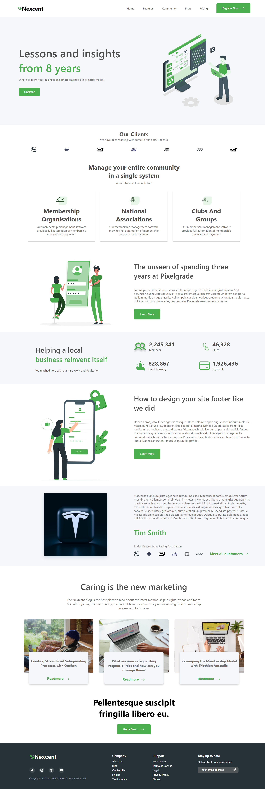

# Agency Website

A modern responsive React website built with JSX and CSS.  
This project was created as **practice for converting a Figma design into a working React application**.

## 🎨 Design Credit
This project is based on a community Figma design by **Muntasir Billah**.
[Agency Website Figma File](https://www.figma.com/community/file/1222060007934600841)  
Licensed under [CC BY 4.0](https://creativecommons.org/licenses/by/4.0/).  

## 🛠️ Tech Stack
- React (JSX)
- CSS3 

